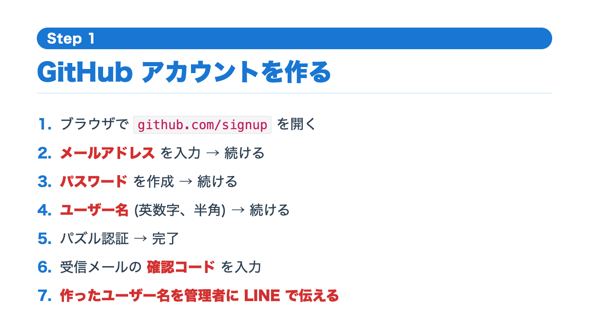
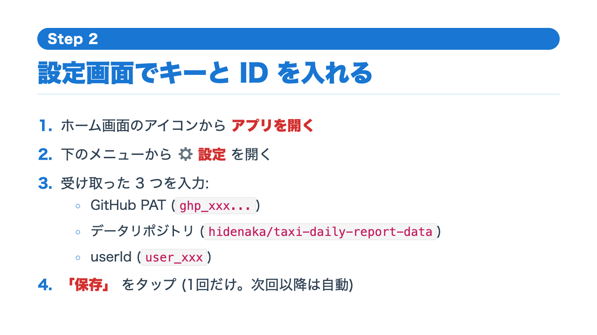
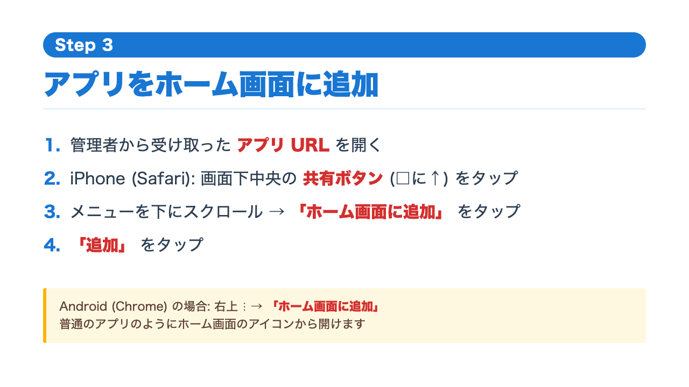
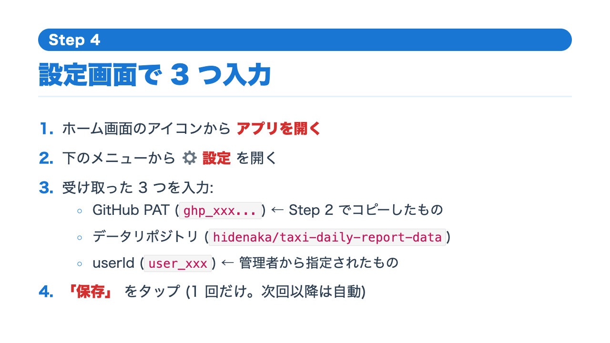

# タクシー日報アプリ セットアップ手順書

スマホでこのアプリを使えるようにする手順書です。**Google アカウント**さえあれば誰でも使えます。GitHub の知識は一切不要です。

---

## 必要なもの

- スマホ(iPhone でも Android でも OK)
- **Google アカウント**(Gmail を持っていればそれでOK)
- 管理者から渡された **3つの情報**:
  1. アプリのURL
  2. アクセス用のキー(`ghp_xxx...` のような長い文字列)
  3. あなた専用のID(`user_xxx` のような文字列)

> 管理者から上の3つを LINE 等で受け取ってからスタートしてください。

---

## Step 1. アプリをホーム画面に追加する

1. **管理者から受け取った URL を開く**(LINEのメッセージのリンクをタップ)
2. iPhone(Safari)の場合: 画面下中央の **共有ボタン（□に↑のアイコン）** をタップ
3. メニューを下にスクロール → **「ホーム画面に追加」** をタップ
4. 「追加」をタップ

> Android(Chrome)の場合: 右上の **︙メニュー** → **「ホーム画面に追加」**

これで普通のアプリのようにホーム画面のアイコンから開けるようになります。

---

## Step 2. 設定画面でキーとIDを入れる

1. ホーム画面のアイコンから **アプリを開く**
2. 下のメニューから **「⚙ 設定」** を開く
3. 管理者から受け取った情報を入れる:
   - **GitHub PAT**: `ghp_xxxxxxxxxx...`(コピペ推奨)
   - **データリポジトリ**: `hidenaka/taxi-daily-report-data`(これは固定)
   - **userId**: `user_xxx`(あなた専用、管理者から指定されたもの)
   - **表示名**: 自由(自分が分かれば何でも)
4. **「保存」** をタップ

> 一度設定したら次回以降は不要です(スマホに記憶されます)

---

## Step 3. 日報の写真を Gemini で変換する

毎日の運用フローです:

1. ブラウザで **https://gemini.google.com** を開く
2. **Google アカウントでログイン**(Gmail のアカウントでOK)
3. 管理者から受け取った **「Gemini プロンプト」**(別途配布)を全部コピー
4. Gemini にプロンプトを **ペースト**
5. **日報の写真を全部アップロード**(複数枚OK、何日分でもOK)
6. **送信ボタンを押す**
7. 数秒〜数十秒で Gemini がテキストを返してくる
8. **返ってきたテキストを全選択 → コピー**

> 20-30枚くらいまでが安定。同じチャットでメッセージ多くなると精度が落ちてきます。定期的に新しいチャットに切り替えてください。

---

## Step 4. アプリにペーストして保存

1. タクシー日報アプリを開く
2. **「📝 入力」** メニューを開く
3. **テキスト貼付エリア** に Step 3 でコピーしたテキストをペースト
4. **「パース」** ボタンをタップ
5. プレビューで **件数・売上・キャンセル数** を目視確認
6. 車種(プレミアム/レギュラー) が間違っていたら手動で直す
7. **「保存」** ボタンをタップ
8. 「保存しました」と出れば完了

> 複数日分まとめてペーストしたい場合は **「📚 一括入力」** メニューから

---

## よくある質問

### Q. Gemini が「写真が読めない」と言う
- 解像度を上げて再撮影
- 1枚ずつアップロードして試す
- 別の角度で撮り直す

### Q. 金額がおかしい
- ¥1,500 と ¥15,000 を AI が読み間違えることがあります
- アプリの「パース」プレビューで目視確認、おかしければ手動修正

### Q. 日付が空欄になっている
- 日報の日付欄が写りにくいことがあります
- アプリ側で手動入力できます

### Q. 「キャンセル」と判定されているのに売上が立っているはず
- 自動判定ルール: ¥400 / ¥500+0km / ¥1000+0km / 「キ」マーク のいずれか
- 通常のキャンセル料はこれで正しく0円扱いになります
- 待機料金が¥1,500等で売上が立つケースは正しく売上扱いになります(キャンセルにはならない)

### Q. 同じ日を間違って2回入れた
- 上書きされるだけなので問題ありません(同じ日付の最新が残る)

### Q. アプリが古いままで新機能が出ない
- ブラウザで開いて **強制リロード**(iPhone Safari は アドレスバー長押し→「再読込を要求」)
- それでも改善しない場合は管理者に連絡

---

## サポート

困ったら管理者に LINE で連絡してください。エラーメッセージのスクリーンショットを送ると解決が早いです。
